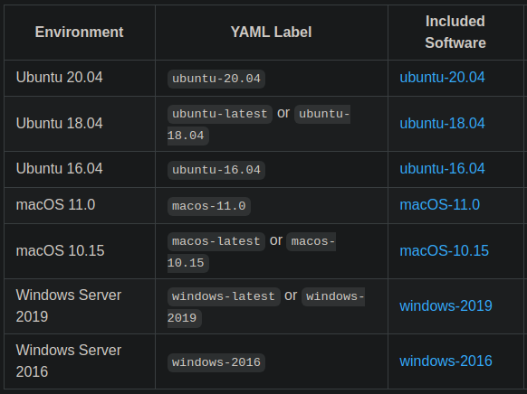
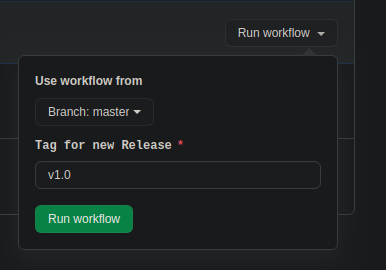
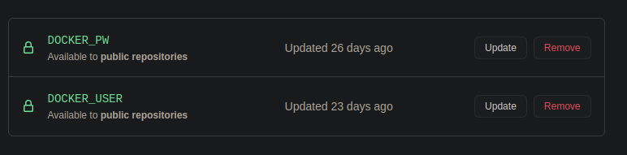
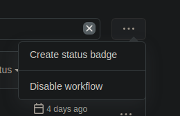
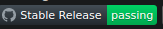

# Github CI/CD

## Github Actions

# Einstieg


# Wie entwickelt man Software?

Code schreiben

Code versionieren, zum Beispiel mit git

Code compilen

Code bündeln

Anwendung dem Kunden übergeben / hochladen und starten

Des Ganze für jeden Commit oder jedes neue Feature

## Geht das auch besser?

Die Abläufe der Schritte ändern sich nicht.

Automatisierung bietet sich an.

# CI/CD

# Definition

**CI/CD** = "Continous integration, continous delivery / deployment"

Philosophie um Software als Team zu entwickeln

Ziel: Redundante Arbeitsschritte zu eliminieren

Vorteil: Zeit der Entwickler/innen kann zum eigentlichen Schreiben verwendet werden

## Contious Integration

Code wird nach dem Versionieren auf eine zentrale Codebase hochgeladen (GitHub, GitLab)

Der "neue" code wird integriert

Mit der Codebase werden automatisiert Arbeitsschritte durchgeführt

Beispiele:
* Building
* UnitTests
* Dependency Vulnerability Checks

## Continous Deployment

Deployment: "Software auf verschiedene Umgebungen verteilen und starten"

Delievery: Aktuellen Code gebündelt einem Kunden zum Abholen bereitstellen

In Zeiten von Anwendungen in der Cloud gibt es viele Möglichkeiten

* Docker Images bauen und pushen
* Maven Packages bauen und pushen
* Anwendung auf Amazon-Web-Services deployen
* Anwendung auf Google-Cloud-Platform deployen
* viele andere...

GitHub bietet eigene [Package Registries](https://github.com/FileFighter/RestApi/packages) an.

## Pipelines

Umsetzung der CI/CD Automatisierung

Verbindung von Version-Controlling mit CI/CD

Verwendet die aktuelle Codebase

Script welches in einer VM oder einem Docker Container (Runner) ausgeführt wird

Script ist typischerweise im YAML Format (YAML ain't Markup Language)

# CI/CD mit GitHub

## GitHub Apps

GitHub bietet einen ["Marketplace"](https://github.com/marketplace?type=apps) an.

Dort findet sich eine Übersicht an Apps und Actions zum Verwenden in eigenen Repositories

Beispiele:
* CodeCov.io [(Beispiel)](https://github.com/FileFighter/RestApi/pull/7#issuecomment-720367783)
* TravisCI
* Dependabot

## GitHub Actions

Pipelines bei GitHub heißen Workflows

Gibts noch nicht lange, ca 1 Jahr.

Bei einem "free" Account auf Github bekommt man 2000 Minuten / Monat.

Die Workflows werden in virtuellen Umgebungen durchgeführt

 

Es gibt auch die Möglichkeit "Self-Hosted-Runner" zu verwenden

## Aufbau

### Events

Mögliche Aktivitäten bei GitHub, lösen Workflows aus.

Beispiele:
* Push
* Commit
* PR create / open / update
* Cron Jobs
* Alle Events: https://docs.github.com/en/free-pro-team@latest/actions/reference/events-that-trigger-workflows

Events sind durch ein logischer "ODER" verknüpft.

```YML

    # This is just a name
    
    
    name: DummyWorkflow


    # Specifies the events that trigger this workflow.

    
    on: push


```

```YML

    # This is just a name
    
    
    name: DummyWorkflow


    # Specifies the events that trigger this workflow.


    on: 
      
      push:
      
      pull_request:
      


```

```YML

    # This is just a name
    
    
    name: DummyWorkflow


    # Specifies the events that trigger this workflow.


    on: [push, pull_request]
      


```

Besonderheit: "workflow_dispatch"



```YML

    name: Create new release
    

    on: 
    
      workflow_dispatch:
        
        inputs:
          
          tag:
            
            description: 'Tag for new Release'     
            
            required: true
            
            default: 'v1.0'
            
            

```

#### Eventbedingungen

Die Events können nochmal genauer spezifiziert werden.

Das hängt von dem Event ab.

Die Eventbedingungen sind durch ein logisches "UND" verknüpft.

```YML

    # This is just a name
    
    
    name: WorkFlowOnMaster


    # This workflow only triggers when a push on master happens.

    
    on: 
    
      push:
        
        branches: [ master ]
        

```

```YML

    # This is just a name
    
    
    name: WorkFlowOnMasterAnSrcChange


    # This workflow only triggers when a push on master happens 
    
    # AND files in src/** have changed.

    
    on: 
    
      push:
        
        branches: [ master ]
        
        files: 
        
          - "src/**"
          
          - "some ressource"
        

```

## Jobs

Jeder Job wird auf einer anderen VM ausgeführt. -> kein "Shared State" zwischen Jobs.

Dadurch ist es möglich auf verschiedenen Betriebssystemen zu arbeiten.

Bestehen aus:
* Namen
* Dem Betriebssystem
* Den Arbeitsschritten

```YML

    # This is just a name
    
    
    name: DummyWorkflow

    
    on: push
    
    
    jobs:
    
      dummy-job-name:
      
        runs-on: ubuntu-latest
    
        steps:
        
        # Do something.
        
        

```

## Steps

Enthalten die eigentlichen Arbeitsschritte.

Die Schritte werden in der VM im Terminal ausgeführt

Daher kann man auf Linux Runnern einfach Bash / Shell Script verwenden.

Schritte werden durch "-" getrennt

Jeder Schritt hat einen Namen.

```YML

    # This is just a name
    
    
    name: DummyWorkflow

    
    on: push
    
    
    jobs:
    
      dummy-job-name:
      
        runs-on: ubuntu-latest
    
        steps:
        
          -
        
            name: DummyStep
          
            run: echo "hello world!"
        
          -
        
          # More steps...
        

```

```YML
  
    
    name: DummyWorkflow

    
    on: push
    
    
    jobs:
    
      dummy-job-name:
      
        runs-on: ubuntu-latest
    
        steps:
        
      
          # Here are some more steps.


          -

            name: Run all Tests.

            run: |
              
              mvn clean test -f pom.xml
                
              mvn clean package -f pom.xml
              
              # more commands
               
          -

            name: Upload Coverage to codecov.io.

            run: bash <(curl -s https://codecov.io/bash) -Z


```

## Actions

Anstelle alles von Hand zu programmieren kann man auch "Actions" einbinden

Actions = vordefinierte Steps entweder von GitHub oder anderen Nutzern

Actions können mit dem Codewort "uses" eingebunden werden

```YML
  
    
    name: DummyWorkflow

    
    on: push
    
    
    jobs:
    
      dummy-job-name:
      
        runs-on: ubuntu-latest
    
        steps:
        
          -
          
            name: Get Code from Repository
            
            uses: actions/checkout@v1

          -
          
            name: Set up JDK
            
            uses: actions/setup-java@v1
            
            with:
              
              java-version: '11.0.8'
              
              architecture: x64
          
          -

            name: Do something in Java
            
            run: # Do something.
        
        

```

# Nützliches

## Secrets

In einem Workflow müssen Passwörter / Tokens nicht im Klartext stehen

```YML

        name: Login to DockerHub
        
        uses: docker/login-action@v1
        
        with:
        
          username: ${{ secrets.DOCKER_USER }}
          
          password: ${{ secrets.DOCKER_PW }}


```



## Badges

Man kann den Status eines Workflows mit einem Badge, in Markdown o.ä, darstellen





## Variablen

Variablen können wie im ausgewählten Betriebssystem verwendet werden.

```YML
  
    
    name: DummyWorkflow

    
    on: push
    
    
    jobs:
    
      dummy-job-name:
      
        runs-on: ubuntu-latest
    
        steps:
        
          -
          
            name: Get Git version
            
            run: |
            
              GIT_VERSION="$(echo $(git --version))"
              
              echo $GIT_VERSION
          
        
        

```

```shell script

git version 2.25.1


```

# Anwendungen

## Beispiele

Code testen bei jedem Push. (master / feature)

Stable Release

Feature Release

Nightly Release

# Danke fürs Zuhören

Folien, Quellen, Code:  

https://github.com/open-schnick/GithubActionsTalk

Restliche gezeigte Workflows findet ihr hier:  

https://github.com/FileFighter/RestApi
